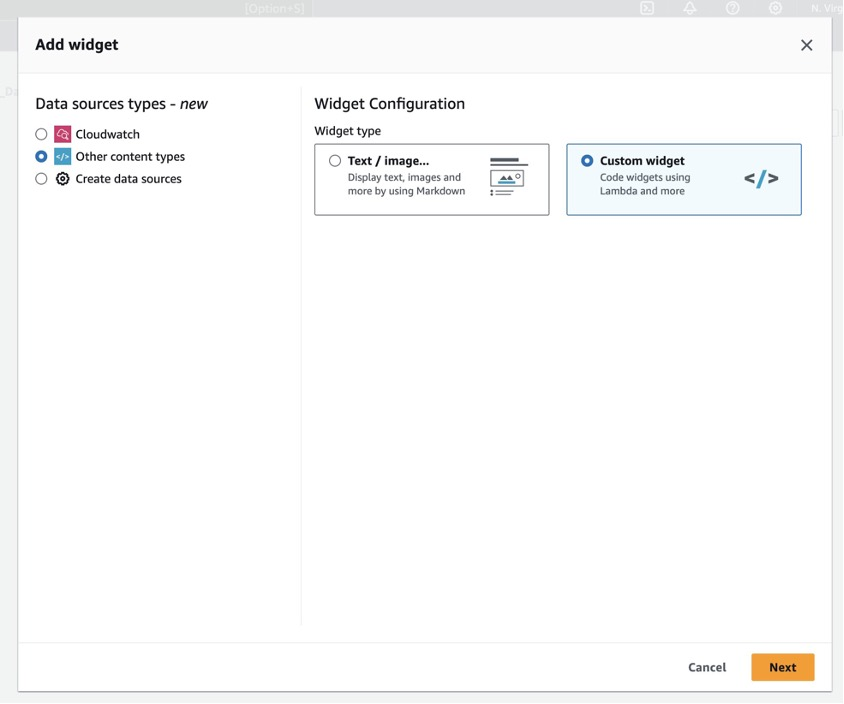
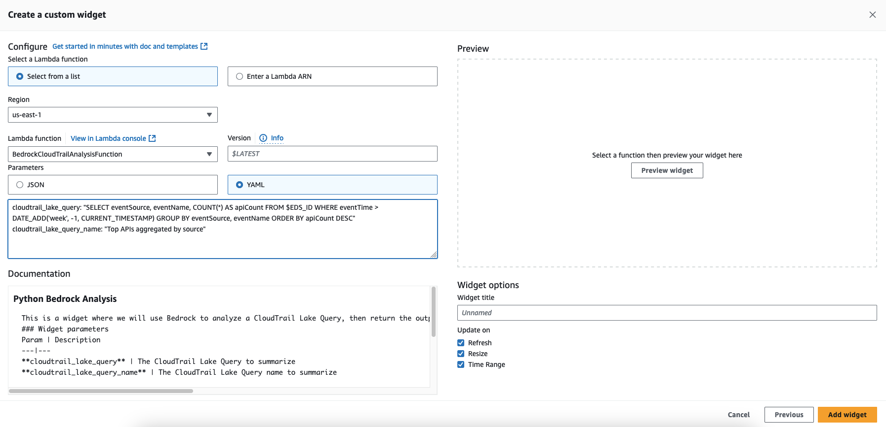

# Using Generative AI to Gain Insights into CloudTrail Lake Queries with CloudWatch Dashboards

# Overview
We recently highlighted in the blog “[**Using Generative AI to Gain Insights into CloudWatch Logs**](https://aws.amazon.com/blogs/mt/using-generative-ai-to-gain-insights-into-cloudwatch-logs/)” on how to use Bedrock to gain insights into your CloudWatch Log Groups.  In the following sample solution, we will show you how to extend this sample solution to provide insights using generative AI for your CloudTrail Lake queries.
 
The sample solution will allow you to create a custom widget that is backed by an AWS Lambda Function. When the dashboard is loaded, or refreshed, CloudWatch invokes the Lambda function to query CloudTrail Lake and send the results to Bedrock for analysis to then display the data it returns as a custom widget in the CloudWatch dashboard.
 
**Note:** This sample solution is for demonstration purposes showing how you can use custom widgets to provide an analysis of your CloudTrail Lake query results using Bedrock for your CloudWatch Dashboards.

# Costs:

The costs associated with using this solution are from the CloudWatch dashboard, the custom widget, a Dynamo DB Table, CloudTrail Lake query and Bedrock. Custom widgets run Lambda code, and in this case the Lambda functions make API calls. The cost should be minimal, but you should still be mindful. As a best practice you can utilize AWS Budgets with Cost Allocation Tags to monitor costs. All pricing details are on the Amazon CloudWatch, AWS CloudTrail, AWS Lambda, DynamoDB, and Bedrock pricing pages.

# Implementation Steps:
## Prerequisites:
*   Claude3 Haiku model access is required to generate the summaries.
    -   Other models can be used, and would require access to the desired model, and modification of the Lambda function code to specify the model and send the information to the model in the correct format.

## Deploy the CloudFormation template to create the resources

1.  Download the [yaml](./cfn/cfn_cloudtrail_lake_analysis.yaml) file.
1.  Navigate to the CloudFormation console.
1.  Choose **Create stack**.
1.  Choose **Template is ready**, upload a template file, and navigate to the yaml file that you just downloaded.
1.  Choose **Next**.
1.  Give the stack a name, and select **Next**.
1.  For the parameter **CloudTrail Lake Event data store ARN**, enter the ARN of your CloudTrail Lake Event data store.
1.  Select **Next**.
1.  Scroll to Capabilities at the bottom of the screen, and check the box **I acknowledge that AWS CloudFormation might create IAM resources with custom names**, and choose **Create stack**.

## Create a CloudWatch dashboard and add the custom widget

1.  Next you need to Navigate to the CloudWatch console → **Create a Dashboard** -> Name your Dashboard.
1.  An **“Add widget”** pop-up will open. Click on **“Other content types”** and select **“Custom widget”**. 

    

1.  Click on **“Next”**.
1.  Choose **“Select a Lambda function“** and choose **“Select from a list”**.
1.  Then, select the Lambda Function called **BedrockCloudTrailAnalysisFunction**.
1.  Next, enter in the **cloudtrail_lake_query** and **cloudtrail_lake_query_name** in the yaml format in the input box under **“Parameters”** section of the widget configuration window.
    

**Optional:** You can also click on **“Get Documentation”** to see the format you need to pass the parameters for the function.

### YAML parameters format

```yaml
cloudtrail_lake_query: "SELECT eventSource, eventName, COUNT(*) AS apiCount FROM $EDS_ID WHERE eventTime > DATE_ADD('week', -1, CURRENT_TIMESTAMP) GROUP BY eventSource, eventName ORDER BY apiCount DESC"

cloudtrail_lake_query_name: "Top APIs aggregated by source"
```

1.  Click on **“Preview Widget”** to see the summary of your CloudTrail Lake Query.

1.  Click on **“Add Widget”**, you will then see the custom widget appear on the dashboard.

1.  Click on **“Save Dashboard”** to save the changes you made.

#   Clean Up:

Delete the CloudFormation stack to terminate all resources.