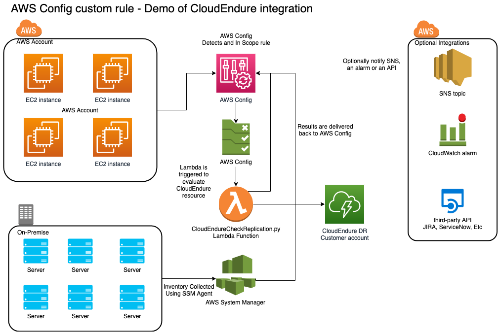

# CloudEndure CheckReplication Custom Rule. 

This sample code demonstrates how you can write and deploy an AWS Config custom rule that can be used to validate CloudEndure replication for either an ec2 instance or a on-premise server. 

## Pre-requisites

•	AWS Config must be enabled on the region where the rule will be deployed. More information on that here. 
•	To validate on-premise server, you must install the AWS System Manager agent on the target server and have AWS System Manager inventory enabled. For information on how to manage on-premise resources using AWS Systems Manager go here. 

## How does it work?

CloudEndure provides an easy-to-use API. Documentation for it can be found here. This rule uses the CloudEndure API to validate if a server is properly configured in CloudEndure. It also checks that there is no lag in replication and that the server has been tested. The Lambda function that powers the custom rule receives as a parameter 3 values: 

1.	The API Token needed to interact with the CloudEndure API  (please note in the sample code this value is being passed as parameter. This exposes the API token in the Config Rule definition. A more robust implementation of this code should read this value from an encrypted Parameter Store Value in the code of the Lambda function.)
2.	The name of the CloudEndure project where the machine should be located.
3.	The EC2 instance ID, or the managed resource ID of the on-premise server, that should be validated in CloudEndure

The code first determines if the resource being evaluated is an EC2 instance or an on-premise resource that has the AWS System Manager agent installed . It then queries the CloudEndure API to check if the machine exists in the configuration . It will then extract the value of the BackLoggedBytes ,the LastConsistencyDate and lastTestLaunchDateTime properties. If the value of any one of this is outside of what is expected for replication to be operational, then the resource is flagged as not compliant. The results are then returned to AWS Config. 

## Overview of the sample rule

## Pre-requisites for deployment

* AWS Account
* AWS Administrator account or an account with enough permission to create IAM resources, Lambda functions and the AWS Config Rule
* AWS Config must be enabled on the region that you will be deploying to. 
* An S3 bucket to state the Lambda package 

## Creating the package for the lambda function. 

The first step is to create the Lambda function package that will be used to deploy the Lambda function for the custom rule. This function has a dependency on the requests python package which is not included in the standard Lambda image for python 2.7. To create the package follow these steps. 
# Download the sample code to your local computer

	
	git checkout git@ssh.gitlab.aws.dev:cca-ambassadors/cloudendurecheckreplication.git
	
	
# Lets Package the python code and the dependencies to get them ready for deployment. Install the requests library so it can be packaged with the Lambda function. More info here 

	
	cd lambda_function
	pip install requests -t ./

	# the following line will create the Lambda package to be uploaded when the function is created
	zip -r ../CloudEndureReplicationCheck.zip .

	#now lets copy the package to an s3 bucket
	aws s3 cp CloudEndureReplicationCheck.zip s3://your-deployment-bucket/ 
	

## Deploy the CloudFormation template 

The CloudFormation template creates the additional resources required to deploy the custom rule. That includes the rule, IAM role, Lambda Function. To create these resources use the AWS Console or command line . Below is an explanation of the parameters required. 

|Parameter	|Description	|Default Value|
| ---------- |----------- | ------------|
|Description	|Description of the Config Rule	|Checks replication status of a machine in Cloud Endure|
|SourceBucket	|Name of the S3 bucket that you have stored the rule zip files in. For example : example-bucket	|See the package step and use that bucket name|
|SourcePath|	Path to the s3 bucket and location where you have stored the rule zip files. For example: /myrulefolder/mylambdacode.zip||	
|SourceHandler	|CloudEndureReplicationCheck.lambda_handler||	
|SourceEvents	|AWS Config resource types that will trigger the evaluation of this rule. In this case ec2 instances and SSM managed instances on-premise	|AWS::EC2::Instance,AWS::SSM::ManagedInstanceInventory|
|Timeout	|The timeout for the Lambda function to run. 	|300|
|RuleName	|Name of the AWS Config Rule	|CloudEndureCheckReplication|
|LambdaFunctionName	|Name of the LambdaFunction	|CloudEndureCheckReplication|
|SourceInputParameters	|Enter the CloudEndure project name and API Token. This is for demo purposes. The API Token should be stored encrypted in a credential platform like Parameter Store or Secrets Manager||

Deploy the CloudFormation template using the Console or the CLI. Once you do you will be able to see your new AWS Config Rule . The rule will detect any resources that exist in CloudEndure and validate that they are setup properly and replicating. 	

