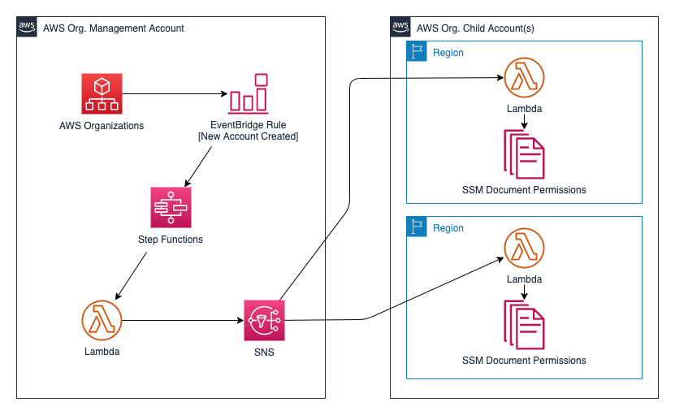

# Automate AWS Organizations SSM Document Share Permissions 

This project contains source code and supporting files for an event-driven serverless application that you can deploy with the SAM CLI and CloudFormation StackSets. Once deployed, the project will trigger a workflow each time a new account is added to an AWS Organizations via the CreateAccount or InviteAccountToOrganization API call.  The workflow will add SSM Document share permissions for the newly added Account ID in a designated AWS Organizations child account and all specified region(s).  

The application uses several AWS resources, including an EventBridge Rule, Lambda functions, a Step Function State Machine, and an SNS topic. These resources are defined in two separate `template.yaml` files in the projects two subdirectories. You can update the template to add AWS resources through the same deployment process that updates your application code.  A ReadMe.md is included in each subdirectory with deployment instructions.

This project includes the following files and folders.

- * **docs** - Directory containing supporting documents
- * **ssm-management-account** - Directory containing the template and code to deploy resources in an AWS Organizations management account via SAM CLI
- * **ssm-child-account** - Directory containing the template to deploy Lambda code via CloudFormation StackSets

## Deployment Instructions

First, deploy the ssm-management-account resources into your AWS Organizations management account via the SAM CLI by following the README.md instructions in the ssm-management-account directory.

Next, deploy the `template.yaml` file in the ssm-child-account directory to the AWS Account in your AWS Organization that contains your SSM Documents.  This `template.yaml` file can be deployed via CloudFormation StackSets or by manually deploying the CloudFormation Stack to your preferred account and region(s).  

If you prefer to use an integrated development environment (IDE) to build and test your application, you can use the AWS Toolkit.  
The AWS Toolkit is an open source plug-in for popular IDEs that uses the SAM CLI to build and deploy serverless applications on AWS. The AWS Toolkit also adds a simplified step-through debugging experience for Lambda function code. See the following links to get started.

* [PyCharm](https://docs.aws.amazon.com/toolkit-for-jetbrains/latest/userguide/welcome.html)
* [IntelliJ](https://docs.aws.amazon.com/toolkit-for-jetbrains/latest/userguide/welcome.html)
* [VS Code](https://docs.aws.amazon.com/toolkit-for-vscode/latest/userguide/welcome.html)
* [Visual Studio](https://docs.aws.amazon.com/toolkit-for-visual-studio/latest/user-guide/welcome.html)

